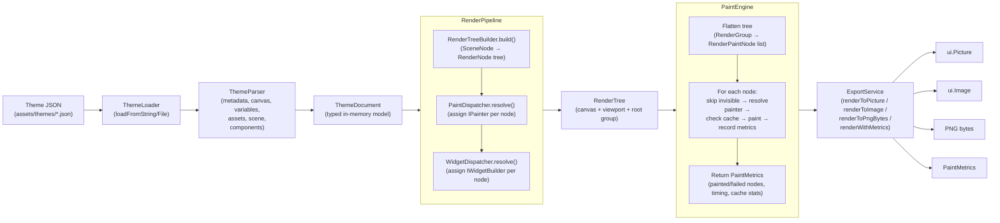

# Theme Engine V2 — Rendering Pipeline

## Pipeline Stages

### 1. Load
- `ThemeLoader.loadFromFile()` / `loadFromString()` reads raw JSON

### 2. Parse
- `ThemeParser` runs a multi-stage pipeline:
  - `MetadataParser` → `ThemeMetadata`
  - `CanvasParser` → `ThemeCanvas`
  - `VariablesParser` → `ThemeVariables`
  - `AssetsParser` → `ThemeAssets`
  - `SceneParser` (via `SceneNodeConverter`) → `List<SceneNode>`
  - `ComponentParser`, `AnimationParser`, `StateParser`

### 3. Prepare
- `RenderTreeBuilder.build()` converts `SceneNode` tree → `RenderNode` tree
- `PaintDispatcher` assigns `IPainter` instances to each `RenderPaintNode`
- Output: `RenderTree` with canvas metadata + root `RenderGroup`

### 4. Paint
- `PaintEngine.render()` flattens tree, iterates nodes:
  - Skip invisible nodes
  - Resolve `BasePainter` via `PainterResolver`
  - Check `PaintCache` (hit → skip)
  - Call `painter.prepare()` + `painter.paint()`
  - Record timing, bounds, metrics

### 5. Export
- `ExportService` wraps the full pipeline:
  - `renderToPicture()` → `ui.Picture`
  - `renderToImage()` → `ui.Image`
  - `renderToPngBytes()` → `Uint8List`
  - `renderWithMetrics()` → `PaintMetrics`

## Key Components

| Component | File | Role |
|---|---|---|
| ThemeParser | `lib/theme_engine/parser/` | JSON → ThemeDocument |
| RenderPipeline | `lib/theme_engine/renderer/render_pipeline.dart` | ThemeDocument → RenderTree |
| PaintEngine | `lib/theme_engine/paint_engine/engine.dart` | RenderTree → painted output |
| ExportService | `lib/theme_engine/export/export_service.dart` | Render → image/file formats |
| RenderingService | `lib/theme_engine/services/rendering_service.dart` | Orchestrate full pipeline |
